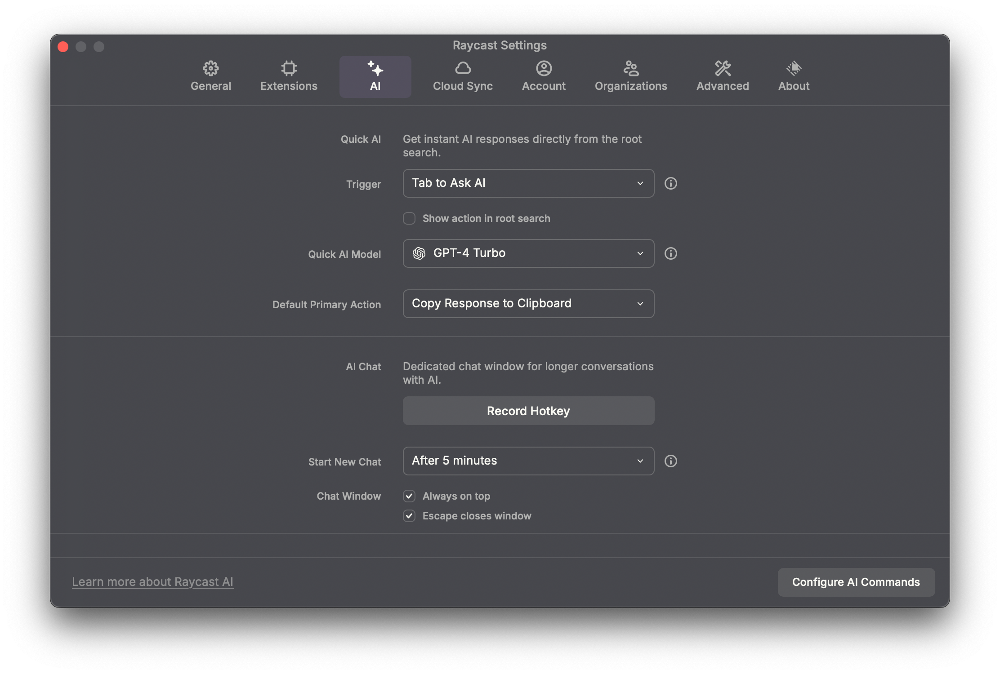

# Fake Raycast Backend


This is a fake Raycast backend that can be deployed to Vercel in just one step.

> [!TIP]
> It can be used to unlock Raycast Pro and Raycast AI (with your own OpenAI API key). Simply click to deploy.

[](https://vercel.com/new/clone?repository-url=https%3A%2F%2Fgithub.com%2Fourongxing%2Ffake-raycast-backend&env=OPENAI_API_KEY,RAYCAST_EMAIL&envDescription=Only%20users%20of%20this%20email%20can%20use%20it.&envLink=https%3A%2F%2Fgithub.com%2Fourongxing%2Ffake-raycast-backend%3Ftab%3Dreadme-ov-file%23fake-raycast-backend)

When deploying, remember to set the `OPENAI_API_KEY` and `RAYCAST_EMAIL` environment variables. The `RAYCAST_EMAIL` should be the email address you use to log in to Raycast.

After deployment, you will receive a URL like `https://fake-raycast-backend-xxxx.vercel.app`. Use network tools like Surge to rewrite the header from `backend.raycast.com` to this URL. Ensure that MitM is enabled on Surge and install the certificate on your device.

For example, you can use the following Surge rule:

```ini
[URL Rewrite]
https:\/\/backend.raycast.com https://fake-raycast-backend-xxxx.vercel.app header
```


> [!WARNING]
> Not recommended. **It's very easy to bump into the paywall**

If you want to use Raycat CloudSync, simply create a Vercel KV database and set the `KV_NAME` environment variable to the name of the KV database.

## Credits
- [Raycast Unblock](https://github.com/wibus-wee/raycast-unblock): Based on this project, I simplified some features and made it easier to deploy to Vercel.